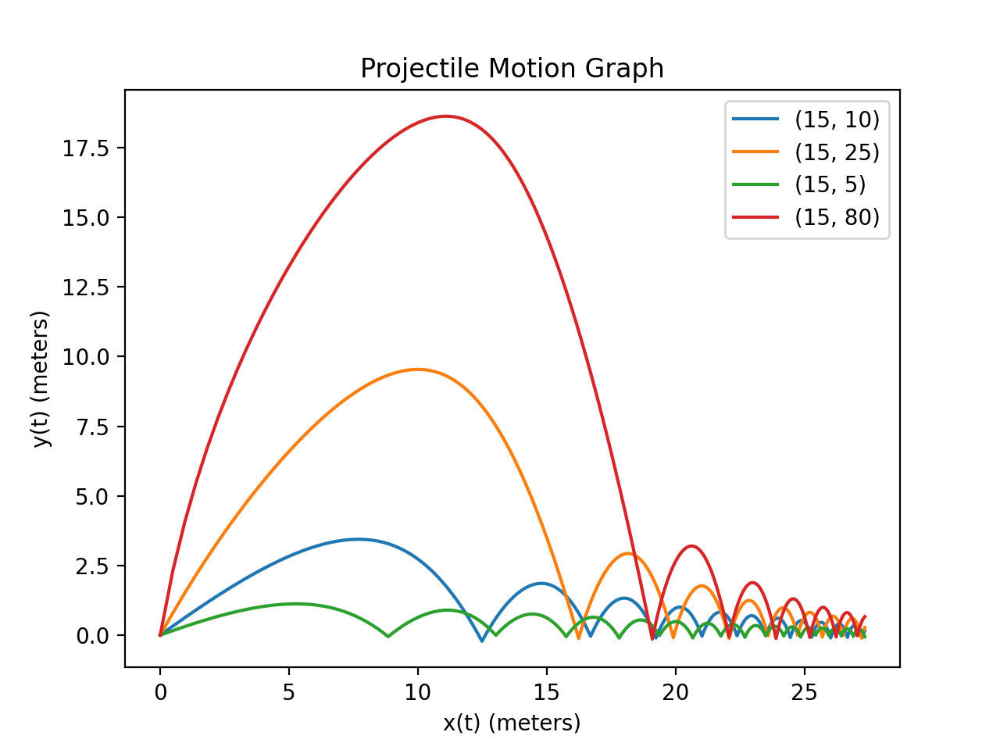
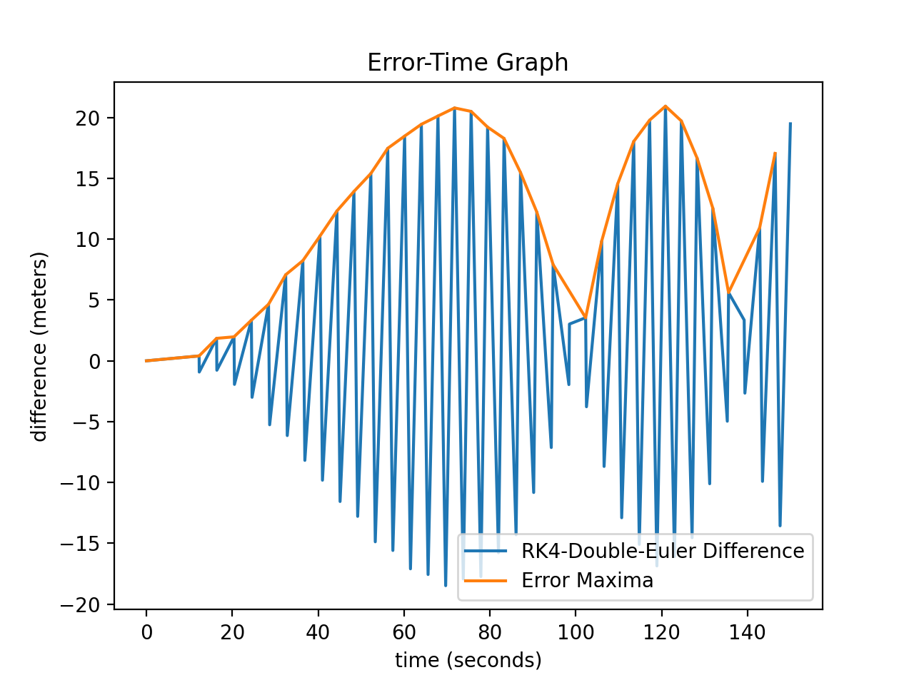
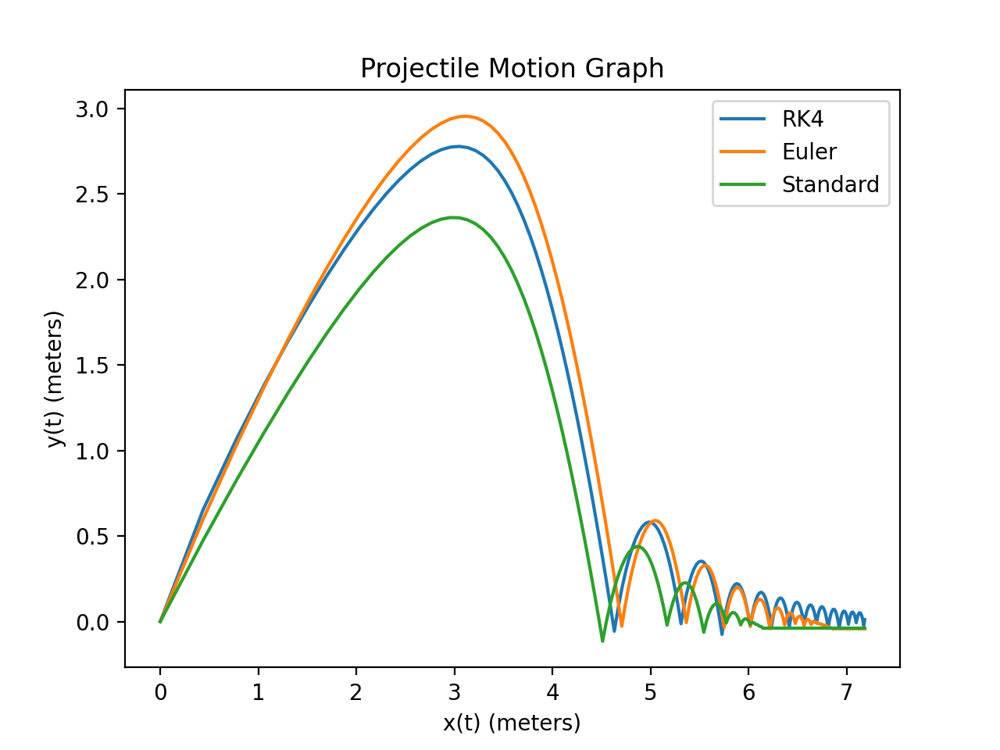

# Numerical Integration Physics Engine
> Initial idea for IB Math AA Higher Level Internal Assessment. Exploring physics engines using explicit integration methods (Euler, Runge-Kutta). Discontinued because I changed topics (see 3D-Vector-Calculus repo for new, complete project). However, the code is finished and works. Initial version done on P5JS using JavaScript, then changed to Python for graphical analysis using MATPLOTLIB.

  

## Numerical Integration Methods Used
* Euler Method
* Embedded Euler Method
* Runge-Kutta Fourth Order Method

## Standard Bouncing Ball (see main.py)
Using numerical integration calculus to approximate a bouncing ball's trajectory.

  

## Air Resistance (see air_resistance.py)
Ordinary Differential Equation for x-position and y-position of ball as it bounces, looks very nice! 

  

## Packages used
* Matplotlib
* Numpy
* SciPy
